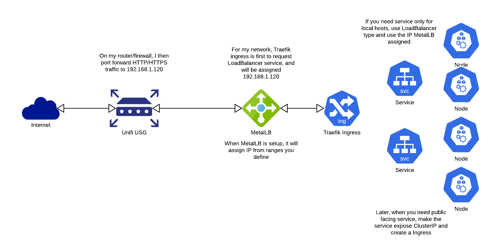

# geck


Raspberry pi based Kubernetes cluster provisioned with Ansible

based on https://github.com/ljfranklin/k8s-pi

## The idea
As single board computers like Raspberry Pi or the LattePanda get more and more popular, more people is moving their homelab solutions to use these because they are cheaper, more energy efficient and more quiet. (Also its fun). The idea is to use a set of Ansible playbooks to provision N Raspberry Pi to run Kubernetes cluster and its necessary services. Later the cluster can be used to various applications in the HomeLab.

> Please do not use this to provision production environments, this is only meant to be used for experiemental reason in a Homelab setting

## The cluster
The Cluster will be provisioned to use Kubernetes with the Traefik ingress controller and MetalLB as baremetal loadbalancer. Cert-manager will also be deployed to the cluster so later SSL certificates can be provisioned automatically. NFS-provisioner is deployed to automatically provision PV as we spin more services.

## Networking
I had a lot of confusion on how this can work in a homelab environment. Since we do not have access to Load Balancers and its hard to tell which type of service we want to use. Following some investigation, I finally ironed out a plan to make this work in homelab. Some lessons I have learnt:

- Never expose using NodePort, just no.
- ClusterIP is useful but you are not gonna proxy it everytime yo use it
- LoadBalancer is good but you need to have something that assign LoadBalancer IP
- Proxying to a gateway and then use nginx to route traffic require too much manual configuration (I even made a API server that update the configs, still too complex)

### Current Solution

Using MetalLB running in layer2 mode, I have given a IP range that it can assign and those IP are blocked from DHCP in my router. When the ingress controller is created first, it will request for LoadBalancer IP and MetalLB will assign a IP for the ingress controller (this is the IP you setup your router to port forward, it will not change). Then when you create services that is going to be public accessible, just create server as ClusterIP and create an Ingress pointing to that. Because of we also added cert-manager. The SSL certificate will be automatically provisioned and assigned to that Ingress.

No More Manual Config!



## Playbooks

__bootstrap.yml__

This is the first thing you run if you want to deploy a fresh cluster, you can also run this to remove the current deployment and create fresh cluster. You should be able to run this over and over again on the same cluster without re-imaging.

__update.yml__

This is the playbook to run when you want to update existing cluster to a latest version, you can run this over and over again to update the infrasture (ie. kubernetes)

__deploy.yml__

This is to run on existing cluster once you already have the necessary services deployed. It deploys all the useful services for the cluster

## Using the playbooks
Usually, you can just run `bootstrap.yml`, it will include all the rest playbooks. The order will be

bootstrap -> update -> deploy

## Preparing the SD card
The project include scripts from the [ljfranklin/k8s-pi](https://github.com/ljfranklin/k8s-pi) that creates SD cards ready to be run in raspberry pi using HypriotOS. This also makes SD card that will make the Raspberry Pi to use cloud-init to do initial setup in a headless way. To provision SD cards run:

```
/pi/provision.sh -d /dev/sda -n k8s-node1 -p "$(kr me)" -i 192.168.1.100
```

* -d Your SD card device path
* -p Your SSH public key
* -n Hosename
* -i The IP address

## Run it

```
ansible-playbook -i inventory/hosts.ini --extra-vars @secrets/secrets.yml bootstrap.yml
```

## Config
You can configure how the script can be run using the `all.yaml` in the `group_vars` folder. There you can configure everything needed to run your cluster.

The config file is grouped into various groups.

- k3s helm related
    - Configure k3s version and helm install version
- Chart urls
    - Various helm chart repo
- cert-manager
    - Cert manager settings, (name for cert issuer)
- Image tags
    - Image tags for services used, you can update them if you they are outdated
- network related
    - Metallb configuration, ip range and mode
- file related
    - Temp file folder
- storage
    - Storage information, (local or external)
- ddns
    - Used for DDNS service
- ingress
    - Ingress information, domains
- unifi
    - Unifi controller url and configuration
- external services
    - External services want to be exposed to the cluster
- misc
    - Anything else

## Included services
Includes services are ones that is installed when you run `bootstramp.yml` I believe anyone using the cluster will need it so they are installed by default.
- K3s with traefik
- Metallb
- Cert Manager
- NFS Provisioner
- Cloudflare DDNS
- Gitea
- Kube dashboard
- OpenVPN
- Proxy for other internal service

